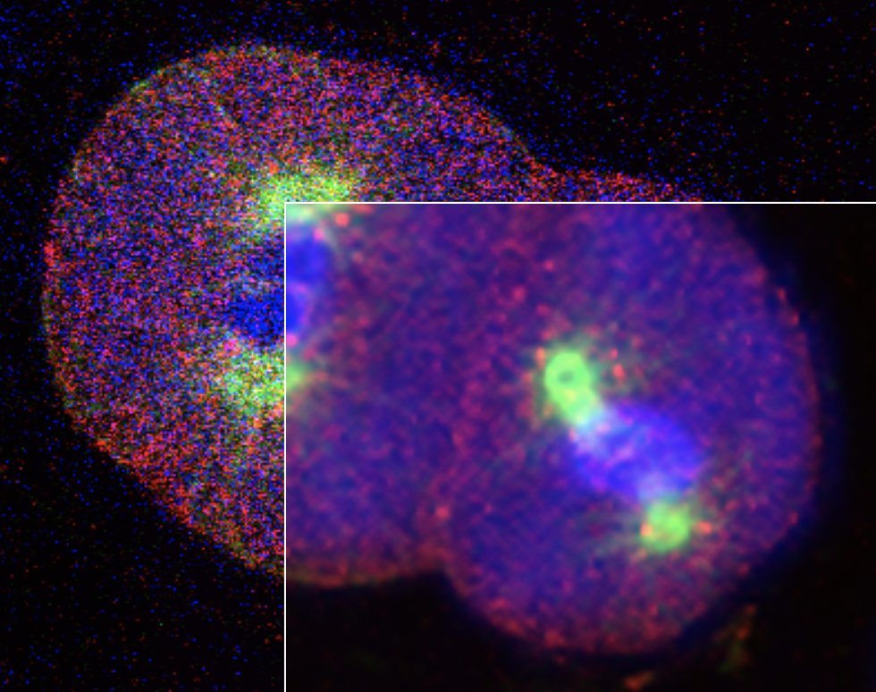

# PureDenoise

## **High-quality denoising of multidimensional fluorescence microscopy images**
> _Florian Luisier at the Biomedical Imaging Group (BIG), EPFL, Switzerland_

[More](http://bigwww.epfl.ch/algorithms/denoise/}

# Outline
The incessant development of improved microscopy imaging techniques, as well as the advent of highly selective fluorescent dyes has made possible the precise identification of tagged molecules in almost any biological specimen. Of particular interest are the visualization and the study of living cells, which induce tight constraints on the imaging process. To avoid the alteration of the sample and to achieve a high temporal resolution, low fluorophore concentrations, low-power illumination and short exposure time need to be used in practice. Such restrictions have a tremendous impact on the image quality. This is why we have recently introduced a new method, coined PURE-LET [1,2,3], for efficient, fast, and automatic denoising of multidimensional fluorescence microscopy images.

# References
1. F. Luisier, C. Vonesch, T. Blu, M. Unser, "Fast Interscale Wavelet Denoising of Poisson-corrupted Images", Signal Processing, vol. 90, no. 2, pp. 415-427, February 2010.
2. F. Luisier, "The SURE-LET Approach to Image Denoising", Swiss Federal Institute of Technology Lausanne, EPFL Thesis no. 4566 (2010), 232 p., January 8, 2010.
3. F. Luisier, C. Vonesch, T. Blu, M. Unser, "Fast Haar-Wavelet Denoising of Multidimensional Fluorescence Microscopy Data", Proceedings of the Sixth IEEE International Symposium on Biomedical Imaging: From Nano to Macro (ISBI'09, Boston MA, USA, June 28-July 1, 2009, pp. 310-313.
ImageJ Plugin

# Warning
The ImageJ plugin is well adapted to denoise images mainly corrupted by Poisson noise which is typically the case for fluorescence microscopy data. It doesn't properly work for other distributions of noise or for saturated images.
